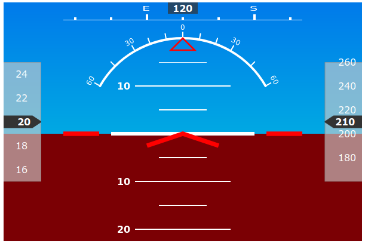

# react-drone-hud

## Heads-Up Display for React-based drone groundstations



[**Examples and Demo**](https://mattr555.me/react-drone-hud/)

## Usage

```js
import DroneHud from "react-drone-hud";

<DroneHud
    width={600} //width in px, best if >= 500
    height={400} //height in px, best if >= 400
    pitch={10} //degrees
    roll={-10} //degrees, -ve -> left bank
    heading={120} //degrees, optional
    airspeed={10} //left-side number, optional
    airspeedTickSize={5} //increments to use for vertical gauge, optional
    altitude={200} //right-side number, optional
    altitudeTickSize={10} //optional
/>;
```

## License

Copyright (c) 2019 Matthew Ramina. MIT License.

I'm placing extreme emphasis on the last paragraph of the [license](LICENSE): I _cannot_ be held liable for any damages caused by this code. _Please_ don't do something stupid and use it in real avionics or something like that, and _please_ follow all safety precautions and regulations when flying.

Boilerplate code forked from [aneldev/dyna-ts-react-module-boilerplate](https://github.com/aneldev/dyna-ts-react-module-boilerplate)
